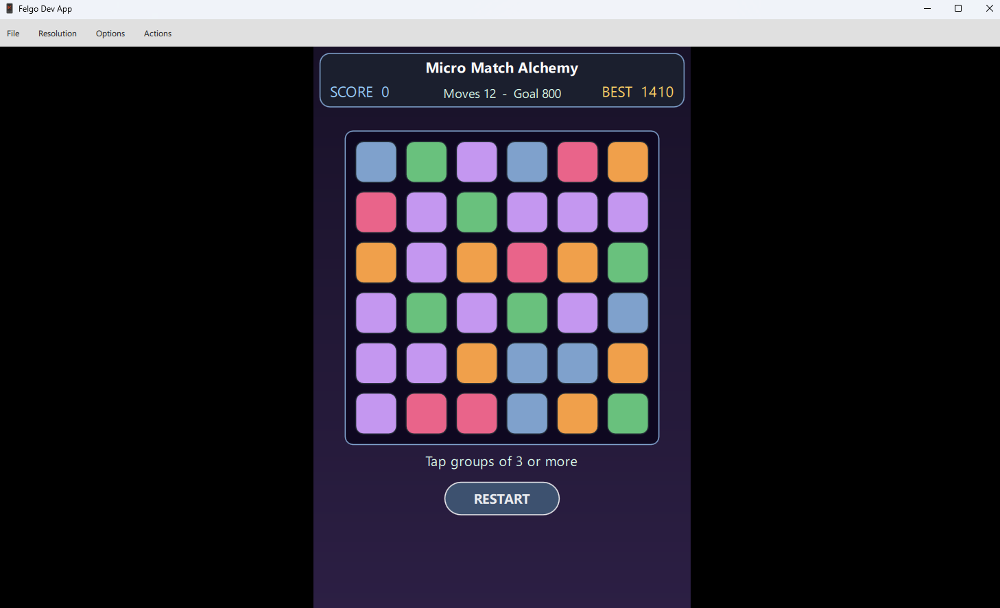
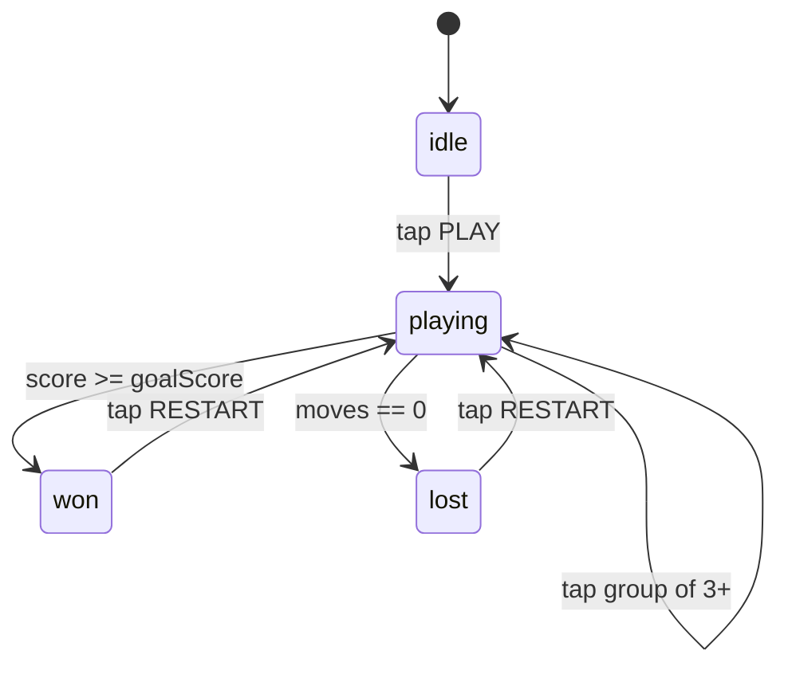
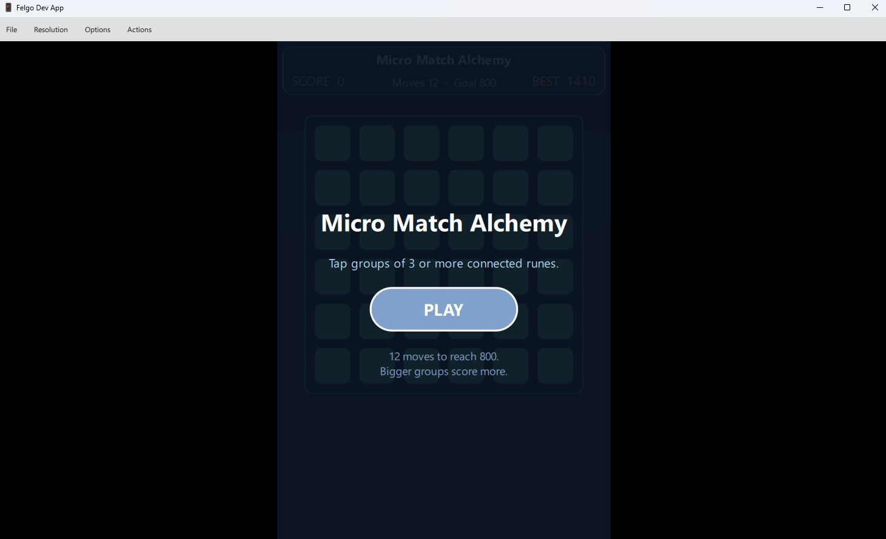
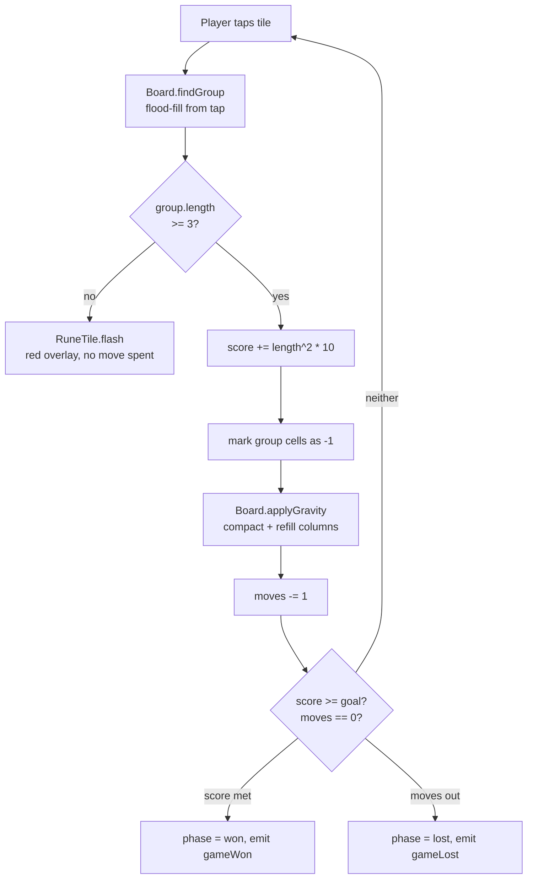
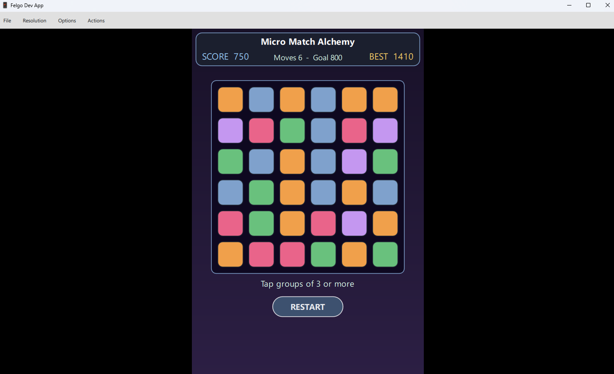
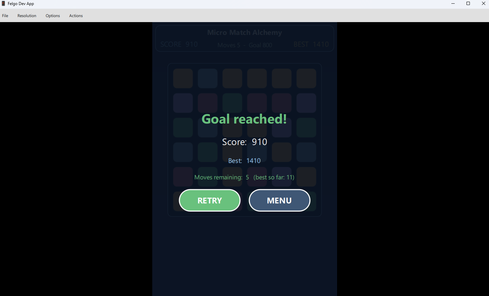
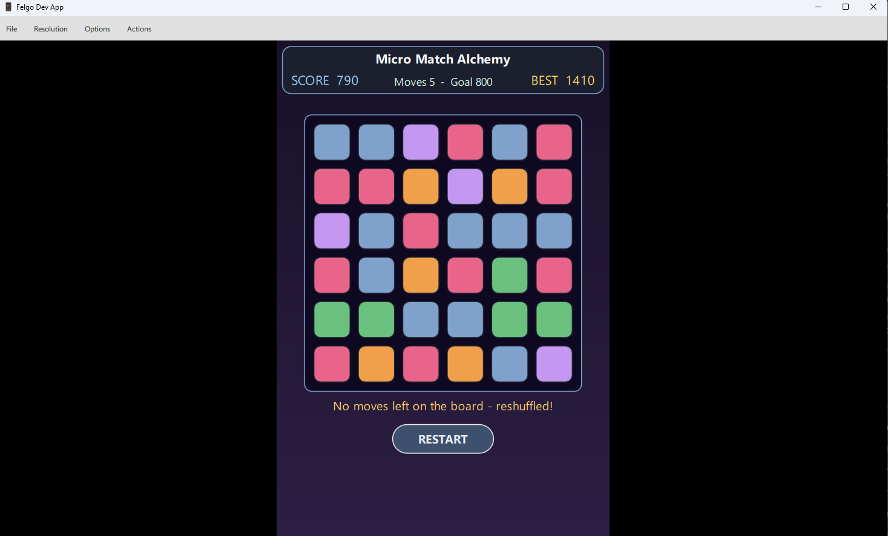

# Micro Match Alchemy: Build a Felgo Tap-to-Clear Match Puzzle

> A 8-10 hour, step-by-step Felgo / QML (Qt Modeling Language)
tutorial showing how to build a tap-to-clear match-group puzzle with
flood-fill grouping, column gravity, refill, and a fixed-move
score-goal win condition.

This is the most logic-heavy of the five challenge prototypes; and
the most teachable. Every milestone (board generation, flood-fill,
gravity, refill, scoring) is a separate runnable checkpoint.




## What you will build

A 6x6 rune-matching puzzle:

- 6x6 board of runes (5 distinct types, hue-coded).
- Tap any group of 3+ connected same-type runes -> they clear.
- Tiles above fall down; new tiles refill from the top.
- 12 moves; score goal 800; win if score >= 800 before moves run out.
- Score formula: `group.length * group.length * 10`; bigger groups score disproportionately more.
- Best score and best moves-remaining-on-win persist.


## High-level game loop

The whole game is a four-state machine. The player taps PLAY to
leave the menu; tapping qualifying groups stays in `playing` until
either the score goal is met (`won`) or the move budget runs out
(`lost`). RESTART returns to a fresh `playing` board.




## Prerequisites

- Felgo SDK (Software Development Kit) 4.x installed on top of Qt 6.8 with MinGW (Minimalist GNU for Windows) or MSVC (Microsoft Visual C++) compiler kit.
- Qt Creator with a "Felgo Desktop Qt 6.x" kit registered.
- Basic QML & JavaScript (JS) familiarity.


## Step 1: Project root + config.json

`File -> New File or Project -> Felgo Games -> Empty Felgo Project`.
Name it `MicroMatchAlchemy`. Felgo SDK 4.x requires a `config`.json
next to the binary at runtime; ship a stub in the project root and
have `main`.cpp self-heal it to multiple paths so the SDK can find
it regardless of CWD (current working directory). Same pattern as
the other four prototypes.

The first launch shows the title menu. PLAY enters `playing`;
QUIT closes the app.




## Step 2: Folder layout

```qml
qml/
  Main.qml
  scenes/GameScene.qml
  components/{RuneTile,Hud,MenuOverlay,GameOverOverlay}.qml
  logic/Board.js
```


## Step 3: Board.js (pure logic)

Isolate the rules so the game is testable. Index helpers, a seedable
mulberry32 RNG (random number generator), board generation,
flood-fill, scoring, gravity:

```qml
.pragma library
function indexAt(row, col, columns) { return row * columns + col }
function rowOf(index, columns)      { return Math.floor(index / columns) }
function columnOf(index, columns)   { return index % columns }

var _seed = 0
function setSeed(s) { _seed = s | 0 }
function _rand() { /* mulberry32: small fast PRNG (pseudo-random number generator) */ return 0 }
function newRune(runeTypes) { return Math.floor(_rand() * runeTypes) }

function makeBoard(rows, columns, runeTypes) {
    var b = new Array(rows * columns)
    for (var i = 0; i < b.length; ++i) b[i] = newRune(runeTypes)
    return b
}
```

**Why pure JS?** Unit tests can drive Board.js via `QJSEngine`
without spinning up a full QML scene. `_extras/tests/tst_Board`.cpp
asserts exact-equality on a seeded board, on flood-fill outputs, and
on the gravity-refill column compaction.


## Step 4: Flood-fill

The connected-group lookup is a textbook iterative breadth-/depth-
first search over 4-connected cells. Pseudocode first, then the
QML/JS:

```qml
procedure findGroup(board, startIndex, rows, columns):
    wanted := board[startIndex]
    if wanted < 0: return empty list
    open  := stack containing startIndex
    seen  := empty set
    group := empty list
    while open is not empty:
        idx := pop(open)
        if idx in seen or board[idx] != wanted: continue
        add idx to seen
        append idx to group
        for each n in neighbours(idx, rows, columns):    // 4-way
            push n onto open
    return group
```

```qml
function neighbours(index, rows, columns) {
    var r = rowOf(index, columns), c = columnOf(index, columns)
    var out = []
    if (r > 0)            out.push(indexAt(r - 1, c, columns))
    if (r < rows - 1)     out.push(indexAt(r + 1, c, columns))
    if (c > 0)            out.push(indexAt(r, c - 1, columns))
    if (c < columns - 1)  out.push(indexAt(r, c + 1, columns))
    return out
}
function findGroup(board, startIndex, rows, columns) {
    var wanted = board[startIndex]
    if (wanted < 0) return []
    var open = [startIndex], seen = {}, group = []
    while (open.length > 0) {
        var idx = open.pop()
        if (seen[idx] || board[idx] !== wanted) continue
        seen[idx] = true
        group.push(idx)
        var ns = neighbours(idx, rows, columns)
        for (var i = 0; i < ns.length; ++i) open.push(ns[i])
    }
    return group
}
```

**Why 4-neighbour, not 8?** Diagonals make groups too easy to form
on a 6x6 grid; the puzzle becomes a paint-by-numbers exercise. 4-way
adjacency keeps the player thinking about row/column structure.


## Step 5: Gravity + refill

Per-column compaction. Returns a NEW board (immutable) so QML
bindings refresh when the GameScene reassigns its `board` property.

Visualisation of one column. Cleared cells are `-1`; gravity pulls
survivors down, then fresh runes fill the top:

```qml
before clear   after clear    after gravity     refill (top)
   A              A              A                 ?
   B             -1              C                 ?
   C              C              D                 A
   D              D              E                 C
   E              E              ?                 D
   B             -1              ?                 E
```

```qml
function applyGravity(board, rows, columns, runeTypes) {
    var out = board.slice()
    for (var col = 0; col < columns; ++col) {
        var kept = []
        for (var row = rows - 1; row >= 0; --row) {
            var v = out[indexAt(row, col, columns)]
            if (v >= 0) kept.push(v)
        }
        for (var writeRow = rows - 1; writeRow >= 0; --writeRow) {
            var next = (kept.length > 0) ? kept.shift() : newRune(runeTypes)
            out[indexAt(writeRow, col, columns)] = next
        }
    }
    return out
}
```

**Why a copy, not in-place mutation?** Reassigning `board = next`
fires the QML binding on every RuneTile's `tileType`. In-place
mutation would silently miss the binding because the array reference
hasn't changed.


## Step 6: RuneTile.qml

A stateless visual: takes a `tileType` (0..4 -> colour) and emits

`clicked(tileIndex`) up to the GameScene. Includes a `flash(`)
function for the too-small-group feedback path.

```qml
Item {
    property int     tileIndex: 0
    property int     tileType:  0
    signal clicked(int tileIndex)
    width: 44; height: 44
    Rectangle {
        anchors.fill: parent; anchors.margins: 2; radius: 8
        color: tileType >= 0 ? palette[tileType] : "transparent"
    }
    MouseArea { anchors.fill: parent; onClicked: root.clicked(tileIndex) }
    Behavior on y { NumberAnimation { duration: 180; easing.type: Easing.OutQuad } }
    Behavior on x { NumberAnimation { duration: 120; easing.type: Easing.OutQuad } }
}
```

**Why `Behavior on x/y** instead of an explicit fall animation?`
After `applyGravity` reassigns the board, every RuneTile's bound

`x` and `y` change to their new column/row positions. The Behavior
turns each binding update into a smooth animated transition for free.


## Step 7: The 6x6 grid via Repeater

```qml
Repeater {
    id: boardRepeater
    model: gameScene.rows * gameScene.columns
    RuneTile {
        tileIndex: index
        tileType:  gameScene.board[index]
        x: Board.columnOf(index, gameScene.columns) * (tileSize + tileGap)
        y: Board.rowOf   (index, gameScene.columns) * (tileSize + tileGap)
        enabled: gameScene.phase === "playing"
        onClicked: gameScene.selectCell(index)
    }
}
```

**Checkpoint #1: 36 random-coloured rounded rectangles render in a
6x6 grid. The grid is non-interactive until the player taps PLAY.**


## Step 8: selectCell; the core mechanic

The full per-tap pipeline. Every player tap walks this flowchart:



```qml
function selectCell(index) {
    if (phase !== "playing") return
    var group = Board.findGroup(board, index, rows, columns)
    if (group.length < 3) {
        boardRepeater.itemAt(index).flash()   // red overlay; no move spent
        return
    }
    score += Board.scoreFor(group.length)
    var next = board.slice()
    for (var i = 0; i < group.length; ++i) next[group[i]] = -1
    next = Board.applyGravity(next, rows, columns, runeTypes)
    board = next
    moves -= 1
    checkEnd()
}
```

**Why no-cost feedback on small groups?** If a wrong tap consumed a
move, players would memorise tile colours before tapping; the game
becomes a memory test, not a spatial-reasoning puzzle. Free probes
keep the input fluid.

**Checkpoint #2: tapping a 3+ group clears it, the column above
falls, new runes refill from the top.**




## Step 9: Win / lose

```qml
function checkEnd() {
    if (score >= goalScore) { phase = "won";  gameWon (score, moves) }
    else if (moves <= 0)    { phase = "lost"; gameLost(score)        }
}
```

The GameOverOverlay reads `phase` and shows either the win or the
lose copy, plus a TRY AGAIN button that calls `startGame(`).




## Step 10: Best-score + best-moves-on-win persistence

In `Main`.qml's `onGameWon`, store both the highest score AND the
fewest moves used on a winning run:

```qml
onGameWon: function(finalScore, movesLeft) {
    var best = storage.getValue("bestScore") || 0
    if (finalScore > best) storage.setValue("bestScore", finalScore)
    var bestMoves = storage.getValue("bestWinMoves") || -1
    if (bestMoves < 0 || movesLeft > bestMoves)
        storage.setValue("bestWinMoves", movesLeft)
}
```


## Bonus: deadlock detection and auto-reshuffle

After every gravity-refill, the GameScene calls `Board.hasAnyMove`.
If no group of 3+ exists anywhere on the board the player is stuck
through no fault of their own; the scene regenerates the board and
shows a transient toast so the player understands what happened.

```qml
procedure afterClear():
    if not Board.hasAnyMove(board, rows, columns):
        board := Board.makeBoard(rows, columns, runeTypes)
        hintToastActive := true        // shows for 2.2 s
        startHintToastTimer()
```




## Step 11: Optional clear SFX

```qml
SoundEffect {
    id: clearSfx
    source: "../../assets/snd/clear.wav"
    volume: 0.6
}
```

Drop a 16-bit WAV in `assets/snd/` to enable. Missing file logs
one warning at load and `play()` becomes silent.


## Step 12: One bug, one fix

First-build issue: tiles teleported to their new positions after a
clear, no falling animation. Cause: `Behavior on y` was on an

`Item` without an actual `y` binding; I'd anchored the tile via

`anchors.top: parent.top; anchors.topMargin: row * 48` and
anchors don't fire `Behavior on y`.

**Fix:** use direct `x` / `y` bindings (computed from `Board.rowOf`
/ `Board.columnOf`) on every tile. The `Behavior` fires when those
bindings change.

**Lesson:** `Behavior on x/y` works on direct property assignments,
not on anchor side-effects. If a smooth transition disappears after
an apparent code re-arrangement, that's the first thing to check.


## Final checklist

- Initial board renders 36 tiles with no missing values.
- Groups smaller than 3 cannot be cleared and do not spend moves.
- Groups of 3+ clear, score, collapse, and refill correctly.
- No column contains -1 (empty cells) after gravity completes.
- Game ends correctly when moves reach 0 or score reaches goal.
- Best score and best-moves-on-win persist across launches.
- `logs/run_*`.log written on every launch.
